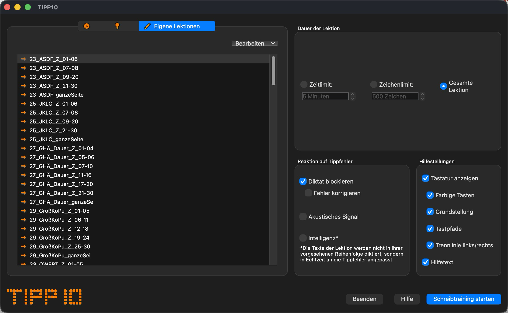

# Tipp10 for modern macOS

An unofficial Qt 6 port of the TIPP10 touch typing tutor, with native Apple
Silicon support and optional local lesson databases.

This project is a **fork of [Karl Zeilhofer's Tipp10 fork](https://github.com/KarlZeilhofer/Tipp10)**,
which is based on the original [TIPP10](https://www.tipp10.com) version 2.1.0 by
Tom Thielicke IT Solutions. It continues Karl's work with updates for modern
macOS; it is not an official TIPP10 release.

## Changes in this fork

- Ported the desktop application to Qt 6 and C++17.
- Added a macOS build script that produces a self-contained `.app` with bundled
  Qt frameworks and plugins, an application icon, and an ad-hoc signature.
- Enabled automatic platform detection, Mac keyboard layout defaults, and
  native macOS widget styling.
- Embedded sounds, offline help, and the original starter database.
- Added optional bundling of a local database for personal builds; school lessons
  are excluded from the default build.
- Added an in-app database export/import tool (Settings > Lernstatistik >
  "Datenbank sichern") with automatic backups before importing.
- Fixed the macOS database path lookup and an out-of-bounds numpad array write.
- Added a smoke test covering lesson input, saved results, database reopening,
  sound loading, help, and settings.

The current build has been verified on **Apple Silicon with macOS 26.6.2 and
Qt 6.11.2**. Intel Macs and other operating systems have not been tested in this
fork. The German interface and disabled legacy `ONLINE` integration are retained
from the upstream fork.

## Build and run on macOS

Install Xcode or its Command Line Tools and [Homebrew](https://brew.sh), then run
these commands from the repository root:

```sh
brew install qtbase qtmultimedia
./scripts/build-macos.sh
open build/macos/bin/tipp10.app
```

You can copy `build/macos/bin/tipp10.app` to Applications. The packaged app includes
its runtime libraries, so Homebrew is only needed to build it.

The script targets the host architecture and macOS major version. The build
produced on macOS 26 requires macOS 26 or later. It is not a universal binary;
building for Intel requires an Intel Qt installation and a corresponding build.
Public distribution requires your own Developer ID signing and notarization.

Build settings can be overridden with environment variables:

| Variable | Purpose |
| --- | --- |
| `QT_PREFIX` | Use a different Qt installation instead of Homebrew's `qtbase`. |
| `QT_LIBRARY_PATH` | Additional library directory for packaging split Qt installations. |
| `BUILD_DIR` | Output directory; defaults to `build/macos`, or `build/macos-custom` with a custom database. |
| `TIPP10_DATABASE` | Explicitly bundle a local SQLite database instead of the original starter database. |
| `JOBS` | Set parallel build jobs; defaults to 8. |
| `MACOSX_DEPLOYMENT_TARGET` | Target an older macOS version, only if all installed Qt libraries support it. |

After changing code, run `./scripts/build-macos.sh` again before copying the app.
A plain `make` rebuild relinks against Homebrew; the packaging step must run again
to restore bundled library paths. A valid code signature alone does not check this.

The root `Makefile` is an old generated Linux build file. Use the macOS script,
which keeps generated files in `build/macos`. See also Qt's
[macOS deployment documentation](https://doc.qt.io/qt-6/macos-deployment.html).

## Lessons and database

Default builds bundle only the original `release/tipp10v2.template`.

### Optional local database

If you have a local copy of the school lessons, or another compatible Tipp10
database, you can explicitly bundle it for personal use:

```sh
TIPP10_DATABASE="$PWD/tipp10v2.db" ./scripts/build-macos.sh
open build/macos-custom/bin/tipp10.app
```

You may instead point `TIPP10_DATABASE` to a file outside this repository. Custom
builds go to `build/macos-custom` by default, keeping them separate from the
standard app in `build/macos`. To return to a standard build, run the script
without `TIPP10_DATABASE` set.

The local `tipp10v2.db`, its SQLite sidecar files, `private-lessons/`, and build
outputs are ignored by Git. Keep other private database files outside the
repository or inside `private-lessons/`. Do not force-add these files. Git ignore
rules do not remove files already committed to history.

**A custom-built app contains the selected database and its lessons.** Keep
that app private unless you have permission to distribute the lesson content.
The optional bundling feature does not grant rights to third-party lessons.

### Active user database

The selected starter database is embedded under the internal resource name
`tipp10v2.template`. The writable `tipp10v2.db` lives directly beside
`tipp10.app` on macOS, or beside the executable on other platforms. For example:

```text
My Tipp10 folder/
  tipp10.app
  tipp10v2.db
```

Keep the app in a folder you can write to. On first launch, if there is no database
beside the app, Tipp10 copies the previously configured database (or the legacy
user database) there, preserving lessons and training results. The original file
is retained. If no previous database exists, it copies the embedded starter.
An existing database beside the app always takes precedence.

The location shown in settings is read-only. When moving the app, move
`tipp10v2.db` with it. Replacing or rebuilding the app leaves that file intact.
Custom lessons appear under **Eigene Lektionen**.

### Importing and exporting the database

Settings > Lernstatistik > **Datenbank sichern** provides two buttons for
managing the whole active database from within the app:

- **Datenbank exportieren...** saves a copy of the current database (all lessons
  and training results) to a location you choose.
- **Datenbank importieren...** replaces the active database with a chosen `.db`
  file. The file is validated before anything is changed, a timestamped backup
  of the current database is created automatically next to it, and the lesson
  list refreshes once the settings dialog closes.

This is the recommended way to back up your data or switch databases (e.g. to
one containing custom lessons) without leaving the app. To replace the database
manually instead:

1. Quit Tipp10 completely.
2. Locate the active database. The default location is shown above; check the
   database path displayed in the application's settings.
3. Back up that database. It contains your own lessons and training history.
4. Copy your chosen database into that location as `tipp10v2.db`.
5. Reopen Tipp10 and select **Eigene Lektionen**.

Either method replaces the active database; neither merges existing lessons or
results. Keep the backup if you need to restore your previous data.

## Smoke test

The test uses a temporary database and temporary settings, leaving your personal
training data untouched. It checks lesson initialization, typing, saved results,
database reopening, embedded sound loading, offline help, and settings writes.

```sh
mkdir -p build/smoke
cd build/smoke
"$(brew --prefix qtbase)/bin/qmake" ../../tests/smoke.pro
make -j8
QT_QPA_PLATFORM=offscreen ./bin/tipp10-smoke ../../release/tipp10v2.template
```

The optional argument verifies that the embedded starter database exactly matches
the specified file.

Sound checks require normal macOS audio access, even with the offscreen platform.

## Upstream work and credits

Karl Zeilhofer's fork improved error correction to behave more like a text
editor and introduced the `ONLINE` build flag during its Qt 4 to Qt 5 transition.
Those changes are inherited here. The legacy network code remains disabled and
has not been ported to Qt 6. The available interface language remains German,
configured by `APP_EXISTING_LANGUAGES_GUI` in `def/defines.h`.



[Upstream demonstration video](https://youtu.be/XZ6Yd2Q7kIQ)

## License

The original TIPP10 code and this fork are distributed under the GNU General
Public License, version 2. See [LICENSE](LICENSE) and the copyright notices in
the source files.
